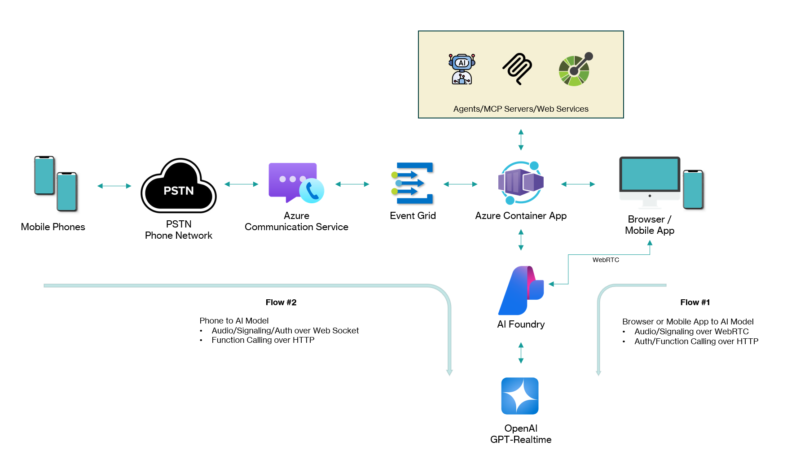

# Agentic Call Center with AI Voice Models

An AI voice interaction platform that enables businesses to deploy intelligent conversational agents across web and phone channels. This solution delivers natural, real-time voice conversations powered by Azure OpenAI's Realtime API, supporting 24/7 automated customer engagement with seamless human escalation when needed. Built for scalability and industry flexibility, it provides a unified framework for deploying AI voice agents in telecommunications, healthcare, retail, and other customer-facing sectors.

<br/>

|  |
|-|


### Purpose
The goal of this IP is to help customers quickly build a Proof of Concept for an Agentic Call Center, showcasing the capabilities of our AI voice-to-voice models and agent-based design while integrating seamlessly with their existing web service infrastructure.


## Architecture Overview

This solution provides two integration modes:

1. **Web-based Realtime Chat** - Direct browser-to-AI or mobile-app-to-AI communication via WebRTC
2. **Phone Call Integration** (Optional) - PSTN phone calls bridged to AI via Azure Communication Services over Web Sockets

||
|-|

### Prerequisites

#### Required: Azure OpenAI Realtime

You need an existing Azure OpenAI resource with the Realtime API (GPT-Realtime) deployed. Gather these details:
- **WebRTC URL** - Regional endpoint (e.g., `https://<region>.realtimeapi-preview.ai.azure.com/v1/realtimertc`)
- **Realtime Session Endpoint** - Session creation URL with API version
- **API Key** - For authentication (or use Managed Identity in production)
- **Model Deployment Name** - Your GPT-Realtime deployment name

#### Optional: Azure Communication Services (Phone Integration)

To enable phone call features, you'll need an Azure Communication Services (ACS) resource with a phone number configured for voice calling. This enables your AI agent to handle inbound and outbound PSTN phone calls.

**Quick Setup Overview:**
1. Create an ACS resource in Azure Portal
2. Purchase a phone number with voice capabilities
3. Configure Event Grid webhooks for call events
4. Set up ngrok for local development (or use your production HTTPS endpoint)

**Required from ACS:**
- Connection String (from ACS Keys)
- Phone Number (purchased with voice capabilities)
- Event Grid webhook configured to your `/api/callbacks` endpoint

📖 **For detailed step-by-step instructions with screenshots, see [README-ACS.md](README-ACS.md)** 

## Deploy with Azure Developer CLI (preferred)

The quickest way to stand up the full solution is with the [Azure Developer CLI (`azd`)](https://learn.microsoft.com/azure/developer/azure-developer-cli/). It creates the Azure resources defined under `infra/`, builds the container image, and deploys the FastAPI + React app as an Azure Container App.

1. **Install prerequisites**
	- Azure subscription with Azure OpenAI Realtime preview access
	- [`azd` CLI](https://learn.microsoft.com/azure/developer/azure-developer-cli/install-azd)
	- Azure CLI (required by `azd`) and authenticated session: `az login`

2. **Configure deployment parameters**
	Open `infra/main.parameters.json` and update the parameter values with your Azure resource details:
	
	**Required parameters:**
	- `webRTCUrl` - WebRTC entry point for your Azure OpenAI region
	- `gptRealtimeUrl` - Azure OpenAI Realtime session endpoint
	- `gptRealtimeKey` - Azure OpenAI API key
	- `azureOpenAiEndpointWs` - Azure OpenAI WebSocket endpoint (starts with `wss://`)
	- `azureOpenAiApiKey` - Azure OpenAI API key
	- `azureOpenAiModelName` - Model deployment name (e.g., `gpt-realtime`)
	
	**Optional parameters (for Azure Communication Services telephony integration):**
	- `azureAcsConnKey` - ACS connection string
	- `acsPhoneNumber` - ACS phone number
	
	The `main.parameters.json` file uses the syntax `${ENV_VAR_NAME=default_value}` to read from environment variables or azd environment. You can either:
	- Edit the default values directly in the JSON file, or
	- Set environment variables using `azd env set` commands:
	
	```powershell
	azd env new
	azd env set WEBRTC_URL "https://<region>.realtimeapi-preview.ai.azure.com/v1/realtimertc"
	azd env set AZURE_GPT_REALTIME_URL "https://<resource>.openai.azure.com/openai/realtimeapi/sessions?api-version=2025-04-01-preview"
	azd env set AZURE_OPENAI_ENDPOINT_WS "wss://<resource-name>.openai.azure.com"
	azd env set AZURE_OPENAI_MODEL_NAME "gpt-realtime"
	azd env set AZURE_GPT_REALTIME_KEY "<your-key>"
	azd env set AZURE_OPENAI_API_KEY "<your-key>"
	```
	

3. **Provision and deploy**
	```powershell
	azd provision --preview   # optional dry run
	azd up
	```

`azd up` returns deployment outputs such as `AZURE_AUDIO_BACKEND_URL`, which matches the value automatically injected into the frontend (`VITE_BACKEND_BASE_URL`).

---

## Manual setup for local development

If you prefer to run everything locally, follow the condensed checklist below.

### Prerequisites
- Python 3.10+
- Node.js 20+
- Azure OpenAI Realtime resource credentials (same values you would provide to `azd`)
- [`uv`](https://github.com/astral-sh/uv) (recommended) or `pip`

### Configure environment
```powershell
Copy-Item .env.sample .env
```

Update the placeholders in `.env` with your Azure resource details:

**Required - Azure OpenAI Realtime:**
- `WEBRTC_URL` - WebRTC entry point for your Azure OpenAI region
  - Example: `https://<region>.realtimeapi-preview.ai.azure.com/v1/realtimertc`
- `AZURE_GPT_REALTIME_URL` - Azure OpenAI Realtime session endpoint
  - Example: `https://<resource-name>.openai.azure.com/openai/realtimeapi/sessions?api-version=2025-04-01-preview`
- `AZURE_GPT_REALTIME_KEY` - API key (only when not using Managed Identity)
- `AZURE_OPENAI_ENDPOINT_WS` - Azure OpenAI WebSocket endpoint
  - Example: `wss://<resource-name>.openai.azure.com`
- `AZURE_OPENAI_API_KEY` - Azure OpenAI API key
- `AZURE_OPENAI_MODEL_NAME` - Model deployment name (e.g., `gpt-realtime`)

**Optional - Azure Communication Services (for telephony integration):**
- `AZURE_ACS_CONN_KEY` - Connection string with endpoint and access key
- `ACS_PHONE_NUMBER` - ACS phone number (e.g., `+18005551234`)


**Optional - Callback configuration with ngrok:**

For local development with Azure Communication Services, you need to expose your local backend to the internet so ACS can send callbacks to your application. [ngrok](https://ngrok.com/) is a tunneling tool that creates a secure public URL forwarding to your local server.

1. **Install ngrok:** Download from [ngrok.com](https://ngrok.com/download), sign up for a free account, and then connect your account. Instructions are available [here](https://ngrok.com/docs/getting-started#windows).
2. **Start ngrok tunnel:**
   ```powershell
   ngrok http 8080
   ```
3. **Copy the forwarding URLs** from ngrok's output (e.g., `https://abc123.ngrok-free.app`)
4. **Update your `.env` file:**
   - `CALLBACK_EVENTS_URI` - HTTP callback endpoint (e.g., `https://abc123.ngrok-free.app/api/callbacks`)
   - `CALLBACK_URI_HOST` - WebSocket callback endpoint (e.g., `wss://abc123.ngrok-free.app`)

**What is ngrok used for in this project?**
When using Azure Communication Services for phone call integration, ACS needs to send real-time events (call status, audio streams, DTMF tones) back to your application. In production, your app would have a public HTTPS endpoint. During local development, ngrok creates a temporary public URL that tunnels traffic to your `localhost:8080`, allowing ACS to reach your local backend. This is only needed if you're testing the telephony/ACS features.


### Install dependencies
- **Using uv (recommended)**
  ```powershell
  conda create -n gpt-realtime-agents python=3.10 -y
  conda activate gpt-realtime-agents
  pip install uv
  uv pip install -e .
  ```


### Run the stack locally
```powershell
cd frontend
npm ci
npm run build
cd ..

uv run uvicorn audio_backend.backend:app --host 0.0.0.0 --port 8080
```
Navigate to `http://localhost:8080/` to verify the React UI and API endpoints.

## Container deployment

The repository includes a Dockerfile that builds the React app and bundles it with the FastAPI service.

```powershell
docker build -t gpt-realtime-agents .
docker run -p 8080:8080 --env-file .env gpt-realtime-agents
```

This multi-stage build does the following:
- Installs Node dependencies, runs `npm ci`, and executes `npm run build` for the React project.
- Installs Python dependencies, copies the FastAPI backend, and bundles the built frontend into `frontend/dist`.
- Launches the combined application using Uvicorn on port 8080.

### Endpoints

**Core Realtime API:**
- `POST /api/session` – returns `{ session_id, ephemeral_key, webrtc_url }`
- `GET /api/tools` – lists tool definitions for the frontend
- `POST /api/function-call` – executes a requested tool and returns structured output
- `GET /healthz` – basic readiness probe
- `GET /runtime-config.js` – returns frontend runtime configuration

**Azure Communication Services (Phone Integration):**
- `POST /api/call` – initiate an outbound phone call via ACS
- `GET /api/source-phone-number` – get the ACS source phone number
- `WebSocket /api/realtime-acs` – WebSocket bridge for ACS audio streams (Phone ↔ ACS ↔ AI Model)
- `POST /api/acs` – handle ACS outbound call events (CloudEvents format)
- `POST /api/callbacks` – handle ACS callback events from Event Grid (inbound calls, call status updates)


## Extending function tools
Add new entries to the `TOOLS_REGISTRY` in `audio_backend/tools_registry.py`. Each tool defines:
- The `definition` sent to Azure Realtime (matching the OpenAI schema)
- The `executor` coroutine/function that returns a JSON-serializable dictionary

The frontend automatically advertises whatever tools the backend exposes and forwards function-call invocations over the `/api/function-call` endpoint.


## Credits

Helper classes and functions for supporting Azure Communications Services, especially the translation of audio message formats between ACS and the AI models, have been taken and adapted from the the below repos:
1. **Realtime Call Center Accelerator** - [link](https://github.com/Azure-Samples/realtime-call-center-accelerator)
2. **Call Center Voice Agent Accelerator** - [link](https://github.com/Azure-Samples/call-center-voice-agent-accelerator)

Thank you!